Magyar kulturális ismereti vizsga
2026.07.18


# 1) Magyarország nemzeti jelképei és ünnepei 
(címer, zászló, korona, Himnusz, Szózat, nemzeti ünnepek)
<br><br>

## 1.1 Nemzeti jelképek

### 1.1.1 A legfontosabb nemzeti jelképeink:
- Zászló
- Szent Korona
- Himnusz
- Magyarország címere
<br><br>

### 1.1.2 Magyarország címere
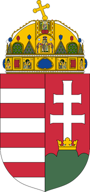

- Vörössel és ezüsttel hétszer vágott mező
- Kettős kereszt
- Hármas halom, rajta korona
<br><br>

### 1.1.3 Magyarország zászlója
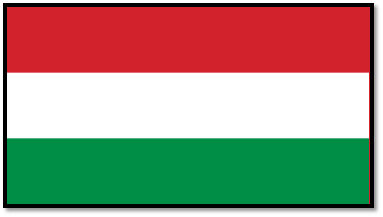

A színek az alábbiakat jelképezik:
- a piros sáv az „erőt” 
- a fehér a „hűséget” 
- a zöld a „reményt”
<br><br>

### 1.1.4 Koronázási jelvények
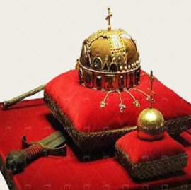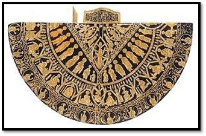

Az egykori királyi hatalom jelképei, jelenleg nemzeti jelképeink részei.
- Koronázási jogar
- Koronázási kard	 	
- Szent Korona
- Országalma                        
- Koronázási palást

A Szent Korona az Országházban tekinthető meg.
<br><br>

### 1.1.5 Egykori magyar koronázó városok
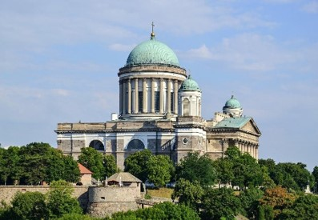 <br> 
*Esztergom*
<br><br>

- Buda
- Esztergom
- Pozsony
- Sopron
- Székesfehérvár
<br><br>

> „Tiszteletben tartjuk történeti alkotmányunk vívmányait és a Szent Koronát, amely megtestesíti Magyarország alkotmányos állami folytonosságát és a nemzet egységét.”

(Magyarország Alaptörvénye)

<br><br>

### 1.1.6 Magyarország himnusza

Kölcsey Ferenc költeménye, 1823-ban íródott.
Erkel Ferenc zenésítette meg.

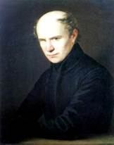 <br> 
*Kölcsey Ferenc*
<br><br>
```
Isten, áldd meg a magyart
Jó kedvvel, bőséggel,
Nyújts feléje védő kart,
Ha küzd ellenséggel;
Bal sors akit régen tép,
Hozz rá víg esztendőt,
Megbünhödte már e nép
A multat s jövendőt!
```

<br><br>

### 1.1.7 Szózat
Vörösmarty Mihály 1836-ban írta. Egressy Béni zenésítette meg.
A Himnusz mellett gyakran énekeljük nemzeti ünnepeken.

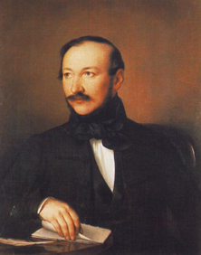 <br> 
*Vörösmarty Mihály*
<br><br>

```
Hazádnak rendületlenűl 
Légy híve, oh magyar; 
Bölcsőd az s majdan sírod is, 
Mely ápol s eltakar.
A nagy világon e kivűl 
Nincsen számodra hely; 
Áldjon vagy verjen sors keze; 
Itt élned, halnod kell.
```
<br><br>

## 1.2 Nemzeti ünnepek
**Március 15.**: az 1848-49-es forradalom és szabadságharc emlékére

**Augusztus 20.**: az államalapítás és az államalapító Szent István király emlékére

**Október 23.**: az 1956. évi forradalom és szabadságharc emlékére


<br><br><br><br>

# 2) Magyarország történelme

## 2.1 Államalapítás

### 2.1.1 Honfoglalás (895-896)
Több száz éves sztyeppei vándorlást követően Árpád vezetésével a 7 magyar törzs a IX. század végén foglalta el a Kárpát-medencét, ahol ezt követően a magyarság letelepedett.
<br><br>

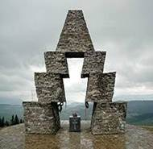 <br> 
*Vereckei-hágó*

<br><br>
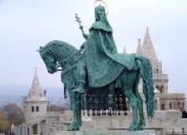 <br> 
*Szent István lovas szobra a Budai várban*

<br><br>

I. Szent István király, az államalapító
- 1001 január 1-én koronázták meg. Az első keresztény magyar király.
- Uralkodása alatt az ország véglegesen a nyugati keresztény kultúra felvétele mellett kötelezte el magát.
- Az ország felvette a római katolikus vallást, a pogány rítussal és életmóddal felhagyott.
- Szent István megszervezte a vármegyerendszert, tíz egyházmegyét, püspökségeket és érsekségeket alapított.
- A Magyar Királyság a középkori Európa erős, meghatározó államává vált.

<br><br>

### 2.1.2 Középkor (XI-XIV. századig)
- Szent István halálával trónviszályok időszaka következett.
- Miután ezek véget értek, az ezt követő korszak két legjelentősebb
Árpád-házi uralkodója Szent László és Könyves Kálmán volt.
- 1222-ben II. András kiadta az **Aranybullát**, a középkori Magyarország egyik legfontosabb közjogi dokumentumát, amely a nemesek jogait összegezte.
- Az 1241-42 között zajló tatárjárás miatt a Kárpát-medence nagy térségei teljesen elnéptelenedtek, az ország megrendült. IV. Béla „a második honalapító” államszervező tevékenysége következtében állt talpra az ország.
- 1301-ben III. András halálával kihalt az Árpád-ház, ezt követően Anjou és Luxemburgi-házból származó királyok uralkodtak Magyarországon.
<br><br>

### 2.1.3 Középkor (XV. század)
- A XV. századtól kezdődően a Magyar Királyság egyre intenzívebb harcokat vívott az Oszmán Birodalommal a Balkánon és az ország déli határain.

- 1456-ban Hunyadi János vezetésével a magyar és a csatlakozott keresztény seregek Nándorfehérvárnál (ma Belgrád) fényes győzelmet arattak az oszmánok felett, ezzel 70 évre feltartóztatva a törökök európai terjeszkedését. A déli harangszó e diadalra emlékeztet.

- Hunyadi Mátyás uralkodása (1458-1490) alatt élte fénykorát a reneszánsz kori Magyarország, amely Európa egyik legerősebb államává vált.
<br><br>

### 2.1.4 Kora újkor
1. A török hódoltság kora (1526-1686)
- 1526 augusztus 29-én Mohácsnál a magyar seregek súlyos vereséget szenvedtek az oszmánok ellen.
- 1541-ben a törökök elfoglalták Budát, a Magyar Királyság központját. Az ország közel 150 évre 3 részre szakadt. A XVI. században folyamatosak voltak a háborúk, ezek közül is kiemelkedik Eger ostroma (1552).
- 1686 szeptember 2-án a Habsburgok vezetésével az európai keresztény sereg visszafoglalta Budát, a következő években az Oszmán Birodalom elvesztette Kárpát-medencei területeinek jelentős részét.
<br><br>

2. Hazánk a Habsburg uralom alatt (1686-1848)
- A török hódoltságot követően a Habsburg uralkodók alatt megindult az ország újjáépítése és a lakatlan területek benépesítése. Az ország ekkor vált soknemzetiségűvé.
- A Habsburg elnyomás ellen 1703-1711 között nemzeti felkelés tört ki II. Rákóczi Ferenc vezetésével. 
<br><br>

### 2.1.5 Reformkor (1825-1848)

A modernkori magyar nemzet megszületésének, a magyar nyelv és kultúra megerősödésének, az első nemzeti intézmények megalapításának időszaka, amely során jelentős gazdasági-társadalmi változások zajlottak le.

A reformkor fő politikai céljai:
- A magyar nyelv hivatalossá tétele
- A magyar alkotmányos intézmények védelme
- A nemzeti fejlődés kereteinek kialakítása
- A feudális viszonyok lebontása
- A polgárosodás megindulása

<br><br>

### 2.1.6 Széchenyi István (1791-1860)
- Főnemesi származású
- A Magyar Tudományos Akadémia alapítója
- Jelentős fejlesztéseket indított a mezőgazdaság, a közlekedés és a hajózás terén
- Nevéhez fűződik a Budát és Pestet összekötő első kőhíd, a Lánchíd megépítése

<br><br>
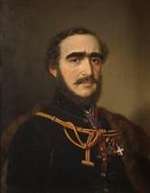 <br> 
*Széchenyi István -- a legnagyobb magyar*

<br><br>

A reformkor további jelentős személyiségei:
- Kossuth Lajos
- Batthyány Lajos
- Wesselényi Miklós
- Deák Ferenc
- Kölcsey Ferenc
<br><br>

### 2.1.7 Az 1848-49. évi forradalom és szabadságharc

Előzmény:
Magyarország az abszolutista Habsburg Birodalom része,
önállósága pedig jelentősen korlátozott.
Bécsben 1848. március 13-án kitört a forradalom, március 14-én érkezett meg a bécsi forradalom híre Pozsonyba és Pest-Budára.

A magyar forradalom kirobbanásának napja: 1848. március 15.
A márciusi ifjak a Pilvax kávéházban gyűltek össze:
- Maguk mellé állították a városi polgárságot, egyetemistákat
- Landerer nyomdájában kinyomtatták követeléseiket (12 pont)
- A Nemzeti Múzeum előtt nagygyűlést rendeztek
- Kiszabadították börtönéből Táncsics Mihályt
- 1848 március 17-én István nádor az uralkodó jóváhagyásával miniszterelnökké nevezte ki Batthyány Lajost
- A márciusi események fontos szereplője volt Petőfi Sándor, Jókai Mór és Vasvári Pál
- Az 1848-’49-es forradalom és szabadságharc egyik legfőbb szimbóluma a piros-fehér-zöld kokárda
<br><br>

### 2.1.8 Az 1848-49. évi forradalom és szabadságharc

1848 április 11-én megalakult az első felelős magyar kormány.

<br><br>

Tagjai:

- Batthyány Lajos 	-– miniszterelnök
- Szemere Bertalan 	-– belügyminiszter
- Kossuth Lajos 		-– pénzügyminiszter
- Széchenyi István 	-– közmunka- és közlekedési miniszter
- Deák Ferenc 		  -– igazságügy-miniszter
- Mészáros Lázár 		-– hadügyminiszter
- Klauzál Gábor 		-– földművelés-, ipar- és kereskedelmi miniszter
- Eötvös József 		-– vallás- és közoktatási miniszter
- Esterházy Pál 		-– a király személye körüli miniszter

<br><br>

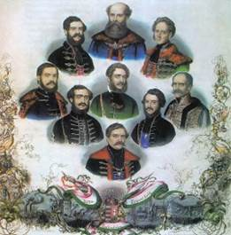 <br> 
*Az első felelős magyar kormány*

<br><br>
<br><br>

### 2.1.9 Az 1848-49. évi forradalom és szabadságharc leverése
A forradalom kezdeti sikereit követően a Habsburgok az orosz cári hadsereg segítségével a szabadságharcot leverték.
1849 augusztus 13-án Világosnál Görgei Artúr tábornok letette a fegyvert az orosz cári hadsereg előtt.

<br><br>

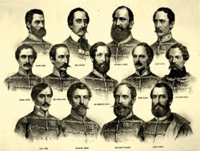 <br> 
*A 􀆟zenhárom aradi vértanú*

<br><br>

A vereség következményei:
- 1849 október 6-án Aradon 13 honvédtisztet, valamint Pesten Batthyány Lajos miniszterelnököt kivégezték.
- Később több ezer szabadságharcost végeztek ki, börtönöztek be vagy ítéltek kényszermunkára. A forradalom legtöbb vívmányát megsemmisítették.
- Az ország alkotmányos rendszerét felszámolták, területi egységét és közigazgatását abszolutista és centralista elvek mentén újraszervezték.
<br><br>

### 2.1.10 Deák Ferenc (1803-1876) és a kiegyezés

- A Batthyány-kormány igazságügy-minisztere
- Az 1867-1918 közötti alkotmányos rendszer egyik megalkotója.
- A forradalom és szabadságharcot követően a megtorlás éveiben vezeti a magyar „passzív ellenállást”.
- Kulcsszerepet játszik a Bécs és Pest-Buda közötti 1867-es kiegyezés és az alkotmányos monarchia tárgyalásaiban.
- A kiegyezéssel létrejött az Osztrák-Magyar Monarchia.
- A kiegyezéstől (1867) az első világháború kitöréséig (1914) tartó időszakot Magyarország egyik aranykorának tekinthetjük. 
  Jelentős gazdasági fejlődés és társadalmi átalakulás vette kezdetét.
<br><br>

### 2.1.11 Az első világháború (1914-1918)

- Az Osztrák-Magyar Monarchia trónörökösét, Ferenc Ferdinándot és feleségét 1914. június 28-án Szarajevóban egy szerb nacionalista merénylő meggyilkolta.
- 1914 július 28-án az Osztrák-Magyar Monarchia hadat üzent Szerbiának, ezzel kitört az első világháború, Európa országai hadba léptek.
<br><br><br>

Egymással szemben álló hatalmak:
- Antant és szövetségesei (Franciaország, Oroszország, Nagy-Britannia, Olaszország, Japán, Amerikai Egyesült Államok, Szerb Királyság, Román Királyság)
- Központi hatalmak (Németország, Osztrák-Magyar Monarchia, Oszmán Birodalom, Bulgária)

Az első világháború az antanthatalmak győzelmével végződött.
<br><br>

### 2.1.12 A trianoni békeszerződés

- A győztes hatalmak az első világháborút lezáró békét, a trianoni békeszerződést 1920. június 4-én íratták alá Magyarországgal.
- A békediktátum következtében Magyarország elveszítette területének mintegy kétharmadát, népessége pedig 18,2 millió főről 7,6 millió főre csökkent. A magyar nemzet egyharmada, 3,3 millió magyar rekedt határainkon kívül.
- 1920-at követően a magyar kormányok alapvető célja az igazságtalan határok felülvizsgálatának elérése, a revízió volt. A ’20-as és ’30-as évek meghatározó politikusai Horthy Miklós kormányzó, Bethlen István és Teleki Pál voltak.

<br><br>

### 2.1.13 A második világháború (1939-1945)
1939 szeptember 1-én Németország megtámadta Lengyelországot, ezzel kitört a második világháború.

Egymással szemben álló hatalmak:
1. Szövetségesek (Egyesült Királyság, Egyesült Államok, Szovjetunió)
2. Tengelyhatalmak (Németország, Olaszország, Japán)

<br><br>

- Magyarország 1941-ben lépett hadba a Tengelyhatalmak oldalán.
- A második világháború alatt a magyar csapatok a keleti fronton harcoltak. 1943 januárjában a 2. magyar hadsereg jelentős része a Don térségében zajló harcokban megsemmisült.
- Németország 1944. március 19-én megszállta Magyarországot. Horthy Miklós kormányzó 1944. őszi lemondását követően az ország a németek bábállamává és hadszíntérré vált.
- A német megszállást követően megindult a többségében vidéki zsidóság szisztematikus deportálása. A holokauszt magyarországi áldozatainak száma 500-600 ezer főre tehető.

<br><br>

### 2.1.14 A második világháború (1939-1945)

- Budapest ostromában a budai vár és a belvárosi részek szinte teljesen megsemmisültek, a fél évig tartó magyarországi harcokban több százezer katona és civil vesztette életét.
- A megszálló szovjet csapatok több százezer embert hurcoltak a Szovjetunióba a Gulagra, kényszermunkára.
- 1945 tavaszán a németek letették a fegyvert, a második világháború véget ért Európában.
- A béketárgyalások következményeként Magyarország újra elvesztette az első (1938) és a második bécsi döntésben (1940) visszakapott területeit, továbbá a győztes hatalmak jóvátétel fizetésére kötelezték. Újra több millió magyar került a határokon kívülre.
- A magyarországi németek (svábok) jelentős részét kitelepítették.

<br><br>

### 2.1.15 Az 1956. évi forradalom és szabadságharc

- Az ország területéről a második világháború lezárása után nem vonult ki a szovjet hadsereg.
- Néhány éves átmeneti parlamenti demokrácia után a Szovjetunió által támogatott kommunisták vették át a hatalmat, és az országban egypártrendszert alakítottak ki. Az eltérő politikai nézeteket vallókat, az egyházakat, a polgárságot és az értelmiséget üldözték. A rendszer gyűlölt vezetője Rákosi Mátyás volt.
- A forradalom 1956. október 23-án a budapesti diákok békés tüntetésével kezdődött. A Magyar Rádió épületénél fegyveres összecsapás alakult ki, a fegyveres harcok pedig hamar szétterjedtek Budapesten.
- A fegyveres ellenállás központja Budapest volt, a forradalmi kormány élére Nagy Imre korábbi kommunista vezető került. Az ellenállás emblematikus helyszínei a Corvin köz és a Széna tér.
- Az 1956-os forradalom és szabadságharc egyik legfőbb jelképe a lyukas zászló, amelyből kivágták a Rákosi-címert.

<br><br>

### 2.1.16 Az 1956. évi forradalom és szabadságharc

- November 4-én a szovjet csapatok ígéretük ellenére, miszerint elhagyják az országot, megkezdték a magyar fegyveres ellenállás felszámolását.
- Visszaállt a kommunista egypártrendszer, Magyarország vezetésére Kádár Jánost jelölték ki, Nagy Imrét pedig kivégezték. A Kádár János nevével fémjelzett kommunista korszak 1956-tól egészen 1989-ig tartott.

<br><br>

### 2.1.18 Az 1989-1990. évi rendszerváltás

- A rendszerváltás egy állam politikai, gazdasági és  társadalmi  rendszerének  alapvető átalakulását  jelenti.  Magyarországon  a rendszerváltás békés úton zajlott, amely során a szocialista egypártrendszer megszűnt, és helyét a többpárti parlamentáris demokrácia vette át.
- 1990 tavaszán demokratikus, szabad parlamenti választásokat tartottak. Antall József  vezetésével  jobboldali  konzervatív kormány  alakult,  az  Országgyűlés  által megválasztott köztársasági elnök Göncz Árpád lett.
- A szovjet csapatok 1991-ben hagyták el végleg az ország területét.


<br><br><br><br>

# 3) Az európai és a magyar irodalom és zenetörténet meghatározó személyiségei
## 3.1 A magyar zenetörténet
Kiemelkedő jelentőségű a magyar népzene
A népdalokat az 1800-as évektől kezdték gyűjteni, dallamukat lekottázni, szövegüket lejegyezni
Bartók Béla és Kodály Zoltán a magyar népzenekutatás két leghíresebb képviselője
Európai színvonalú a magyar opera
<br><br>


**Kiemelkedő alkotók és leghíresebb műveik:**
- Erkel Ferenc (Bánk bán opera)
- Liszt Ferenc (Magyar rapszódiák)
- Bartók Béla (A kékszakállú herceg vára)
- Kodály Zoltán (Háry János)
<br><br>


**A reneszánsz irodalom kiemelkedő alakjai:**
- Janus Pannonius: Pannónia dicsérete
- Balassi Bálint: Hogy Júliára talála, így köszöne néki
<br><br>

**A barokk irodalom kiemelkedő alakja:**
- Zrínyi Miklós: Szigeti veszedelem
<br><br>

**A felvilágosodás irodalmának kiemelkedő alakjai:**
- Csokonai Vitéz Mihály: A reményhez
- Batsányi János: A franciaországi változásokra
<br><br>

**A klasszicista irodalom kiemelkedő alakjai:**
- Kazinczy Ferenc (a hazai nyelvújítás vezéralakja)
- Berzsenyi Dániel: Az első szerelem
<br><br>

## 3.2 A romantika:

Az 1820-as éveket a politika és az irodalom szoros összefonódása jellemezte, ekkor vált Pest-Buda az ország irodalmi középpontjává. Újságok, folyóiratok indultak, megkezdte működését a Magyar Tudományos Akadémia, 1837-ben pedig megnyitotta kapuit a Nemzeti Színház elődje, a Pesti Magyar Színház.
<br><br>

Kiemelkedő alakjai és egy jelentős művük:
- Kölcsey Ferenc: Himnusz
- Vörösmarty Mihály: Szózat
- Petőfi Sándor: Nemzeti dal
- Jókai Mór: A kőszívű ember fiai
- Arany János: A walesi bárdok
- Katona József: Bánk bán
- Madách Imre: Az ember tragédiája

<br><br>

## 3.3 A 20. század kiemelkedő költői, írói és egy jelentős művük:
- Ady Endre: Elbocsátó, szép üzenet
- Móricz Zsigmond: Rokonok
- Kosztolányi Dezső: Édes Anna
- Karinthy Frigyes: Így írtok ti
- József Attila: Tiszta szívvel
- Radnóti Miklós: Nem tudhatom…
- Márai Sándor: Egy polgár vallomása

<br><br>

## 3.4 Az európai irodalom és zene
 
**Az európai irodalom kiemelkedő alakjai és egy jelentős művük:**
- William Shakespeare: Rómeó és Júlia
- Voltaire: Candide
- Johann Wolfgang von Goethe: Faust  
 <br><br>

**Az európai zene kiemelkedő alakjai és egy jelentős művük:**
- Ludwig van Beethoven: IX. szimfónia (az Európai Unió himnusza)
- Wolfgang Amadeus Mozart: A varázsfuvola
- Pjotr Iljics Csajkovszkij: A hattyúk tava  
<br><br>
    
      
Az Európai Unió egyik jelképévé vált dallam Ludwig van Beethoven 1824-ben bemutatott IX. szimfóniájának negyedik tétele, Friedrich von Schiller 1785-ös lírai költeményének, az Örömódának a megzenésített változata.


<br><br><br><br>

# 4) Az Alaptörvény alapvető intézményei
## 4.1 Magyarország Alaptörvénye
Az Alaptörvény különleges, a többi törvény felett álló, legmagasabb jogi erővel bíró norma, Magyarország alkotmánya. Magyarország jogrendjének alapja.
Az Országgyűlés 2011. április 18-án fogadta el Magyarország új Alaptörvényét, amely 2012. január 1-én lépett hatályba.
<br><br>

Az Alaptörvény megalkotásakor az Országgyűlés Magyarország alkotmányos hagyományainak tiszteletben tartását, a stabil és demokratikus alkotmányos intézményrendszer és kormányzat biztosítását, továbbá a nemzeti függetlenség és szuverenitás, a keresztény értékek és az európai kultúra megőrzését, valamint a családok és a határon túli magyar közösségek védelmét tartotta szem előtt.
<br><br>

## 4.2 Az Országgyűlés
Magyarország legfőbb népképviseleti szerve.
Tagjait 4 évre választják.
Az országgyűlési képviselők száma **199 fő**.

<br><br>

Legfőbb feladatai:
- megalkotja és módosítja Magyarország Alaptörvényét,
- törvényeket alkot,
- elfogadja a központi költségvetést, és jóváhagyja annak végrehajtását,
- megválasztja a miniszterelnököt, dönt a Kormánnyal kapcsolatos bizalmi kérdésekről.

<br><br>

## 4.3 A Kormány

A Kormány és a neki alárendelt közigazgatás alkotja a végrehajtó hatalmat.
Tagjai a kormányfő (miniszterelnök) és a miniszterek.
<br><br>

Magyarország miniszterelnöke: Magyar Péter
az Országgyűlés választja meg,
a Kormány feje,
képviseli Magyarországot az Európai Tanácsban
<br><br>

A Kormány főbb feladatai:
irányítja a közigazgatás munkáját és összehangolja tevékenységét,
jogszabályokat alkot,
működteti az állami ellátórendszereket (pl.: honvédelem, rendvédelem, oktatás, egészségügy)
<br><br>

## 4.4 Minisztériumok
1. Agrár- és Élelmiszergazdaságért Felelős Minisztérium
2. Belügyminisztérium
3. Egészségügyi Minisztérium
4. Élő Környezetért Felelős Minisztérium
5. Gazdasági és Energetikai Minisztérium
6. Honvédelmi Minisztérium
7. Szociális és Családügyi Minisztérium
8. Vidék- és Településfejlesztési Minisztérium
9. Igazságügyi Minisztérium
10. Oktatási és Gyermekügyi Minisztérium
11. Közlekedési és Beruházási Minisztérium
12. Külügyminisztérium
13. Miniszterelnökség
14. Pénzügyminisztérium
15. Társadalmi kapcsolatokért és Kultúráért felelős Minisztérium
16. Tudományos és Technológiai Minisztérium

<br><br>

## 4.5 A köztársasági elnök
Magyarország államfője, aki kifejezi a nemzet egységét és őrködik az államszervezet demokratikus működése felett.

Magyarország köztársasági elnöke: Dr. Sulyok Tamás

- az Országgyűlés választja 5 évre titkos szavazással - legfeljebb egy alkalommal újraválasztható
- a Magyar Honvédség főparancsnoka
- összehívja az Országgyűlés alakuló ülését
- feloszlathatja az Országgyűlést (Alaptörvényben meghatározott esetekben)
<br><br><br><br>


# 5) Alapvető állampolgári jogok és kötelezettségek

## 5.1 Az emberi jogok
- Európában az emberi jogok eszméje több száz éves fejlődési folyamat eredménye, amely még korábbi, ókori előzményekre tekint vissza.
- Kiemelt jelentősége van ebben többek közt az angol Magna Charta Libertatumnak (1215), a magyar Aranybullának (1222), valamint a francia Emberi és Polgári Jogok Nyilatkozatának (1789).
- A 17-18. században kialakult polgári társadalmak egyre erőteljesebben léptek fel a jogegyenlőség elérése érdekében. A jogegyenlőség azt jelenti, hogy az állam minden polgárát egyenlő jogok illetik meg, és a törvény előtt minden állampolgár egyenlő.
- Mérföldkő ebben a folyamatban az Emberi Jogok Európai Egyezménye (1950). Az egyezmény arra kötelezi az államokat, hogy a benne meghatározott szabadságjogokat biztosítsák a joghatóságuk alatt élő egyének számára.
<br><br>

Kialakulásuk sorrendje szerint az alapjogok alábbi generációit különböztetjük meg:
- Első generációs jogok: 
1. az élethez való jog, 
2. a személyi szabadsághoz való jog, 
3. az egyesülési és gyülekezési szabadság, 
4. a lelkiismereti és vallásszabadság, 
5. a szólás- és sajtószabadság
<br><br>

- Második generációs jogok: 
1. munkához való jog, 
2. sztrájkhoz való jog, 
3. oktatáshoz való jog, 
4. szociális biztonsághoz való jog
<br><br>

- Harmadik generációs jogok: 
1. egészséges környezethez való jog, 
2. gyermekek jogai, 
3. betegjogok, 
4. fogyatékkal élők jogai


## 5.2 Az Alaptörvényben biztosított alapvető jogok
Magyarország elismeri az ember sérthetetlen és elidegeníthetetlen alapvető jogait, ezek tiszteletben tartása és védelme az állam elsőrendű kötelessége.
<br><br>

Alapvető jogot korlátozni csak másik alapvető jog vagy valamely alkotmányos érték védelme érdekében lehet.
<br><br>

Az Alaptörvényben biztosított legfőbb alapvető jogok:
- törvény előtti egyenlőség
- élethez és emberi méltósághoz való jog
- tisztességes eljáráshoz való jog
- gondolat-, lelkiismeret- és vallásszabadság 
- véleménynyilvánítás szabadsága
- gyülekezési szabadság
- tulajdonjog és örökléshez való jog
- személyes adatok védelméhez való jog
<br><br>

A halálbüntetés Magyarországon:
1990-ben törölték el, miután az Alkotmánybíróság alkotmányellenesnek nyilvánította.

<br><br><br><br>

# 6) Európa és Magyarország a mindennapokban
<br><br>

## 6.1 Magyarországról általánosságban
- Államformája: köztársaság
- Területe: 93 ezer km².
- Népessége: 9,6 millió fő
- Fővárosa: Budapest
- Tájegységei: Alföld, Alpokalja, Dunántúli-dombság, Dunántúl-középhegység, Északi-középhegység, Kisalföld
- Legnagyobb tavai: Balaton, Fertő tó, Velencei-tó
- Legnagyobb folyói: Duna, Tisza, Dráva, Rába
- Szomszédos országok: Szlovákia, Ukrajna, Románia, Szerbia, Horvátország, Szlovénia, Ausztria
- Pénzneme: forint
- Hivatalos nyelve: magyar
- Nemzetiségei: bolgár, görög, horvát, lengyel, német, örmény, roma, román, ruszin, szerb, szlovák, szlovén és ukrán
<br><br>

## 6.2 Magyarország fővárosa: Budapest
Magyarország tizenkilenc vármegyéje:
- Baranya
- Borsod-Abaúj-Zemplén 
- Bács-Kiskun
- Békés
- Csongrád-Csanád 
- Fejér
- Győr-Moson-Sopron 
- Hajdú-Bihar
- Heves
- Jász-Nagykun-Szolnok 	
- Komárom-Esztergom 
- Nógrád
- Pest 
- Somogy
- Szabolcs-Szatmár-Bereg
- Tolna
- Vas 
- Veszprém 
- Zala
<br><br>

Budapest és nevezetességei
1873 november 17-én jött létre a Duna bal partján fekvő Pest, valamint a jobb partján elterülő Buda és Óbuda városainak egyesítésével. 1994 óta 23 kerülettel rendelkezik.
<br><br>

Főbb nevezetességei:
- Budavári Palota
- Citadella
- Gellért Gyógyfürdő
- Halászbástya
- Hősök tere
- Magyar Nemzeti Múzeum
- Magyar Zene Háza
- Magyar Állami Operaház
- Mátyás-templom
- Parlament
- Szent István Bazilika
- Széchenyi Lánchíd
- Szépművészeti Múzeum
- Vajdahunyad vára
<br><br>

## 6.3 Hungarikumok
Azok az alkotások, jellegzetes tárgyak, szokások, amelyek tipikusan magyar vonatkozásúak, semmilyen más népre nem jellemzőek, csak a magyarokra. A „hungarikum” szó Magyarország latin nevéből ered (Hungária).
<br><br>

- Ételek: gulyásleves, bajai és tiszai halászlé, dobostorta, Pick téliszalámi 
- Ételek, alapanyagok: makói hagyma, kalocsai és szegedi őrölt fűszerpaprika
- Italok: magyar borok (tokaji aszú, egri bikavér), pálinkák
- Kulturális örökség: mohácsi busójárás, Pannonhalmi Bencés Főapátság, Hollókő, Füredi Anna-bál
- Állatok: szürke szarvasmarha, magyar pásztorkutyák (puli, komondor, kuvasz) és magyar vadászkutyák (magyar vizsla, erdélyi kopó)
- Nép- és iparművészet: halasi csipke, matyó népművészet, hollóházi és Zsolnay-porcelán
<br><br>

## 6.4 Kereszténység Magyarországon
Magyarország legrégibb és legjelentősebb felekezetei:
- Magyar Katolikus Egyház (latin és görög)
- Magyarországi Református Egyház
- Magyarországi Evangélikus Egyház
<br><br>

Legfontosabb keresztény ünnepek és magyar szokások:
- Karácsonykor (december 24-26.) a keresztények Jézus, a Megváltó születését ünneplik. Az egyik legfontosabb keresztény és családi ünnep.
- Húsvétkor Jézus kereszthalálára emlékezünk és feltámadását ünnepeljük.
- Augusztus 20-a Szent István király, a magyar államalapítás napja, ekkor kerül sor a Szent Jobb Körmenetre a király ereklyéjével, majd következik az esti tűzijáték.
<br><br>

Legfontosabb magyar szentek és boldogok:
- Szent István, Szent László, Szent Imre, Szent Gellért,
- Árpád-házi Szent Margit, Árpád-házi Szent Erzsébet
<br><br>


## 6.5 Magyarország és az Európai Unió

Magyarország 2004. május 1-jén csatlakozott az Európai Unióhoz. Az Európai Unióban 450 millió polgár él.
Magyarország 2007-ben csatlakozott a schengeni övezethez, amely a határok szabad átjárhatóságát biztosítja.
Az Unió központja Brüsszel. Legfontosabb intézményei az Európai Bizottság, a Tanács, az Európai Parlament és az Európai Tanács.
Az európai uniós parlamenti választásokat ötévente tartják. Magyarország 21 fővel képviselteti magát az Európai Parlamentben.
<br><br>

## 6.6 Az Európai Unió 27 tagállama
- Ausztria	
- Belgium	
- Bulgária
- Ciprus
- Csehország
- Dánia
- Észtország
- Finnország
- Franciaország
- Görögország
- Hollandia
- Horvátország
- Írország
- Lengyelország
- Lettország
- Litvánia	
- Luxemburg
- Magyarország
- Málta
- Németország
- Olaszország
- Portugália
- Románia
- Spanyolország
- Svédország
- Szlovákia
- Szlovénia


